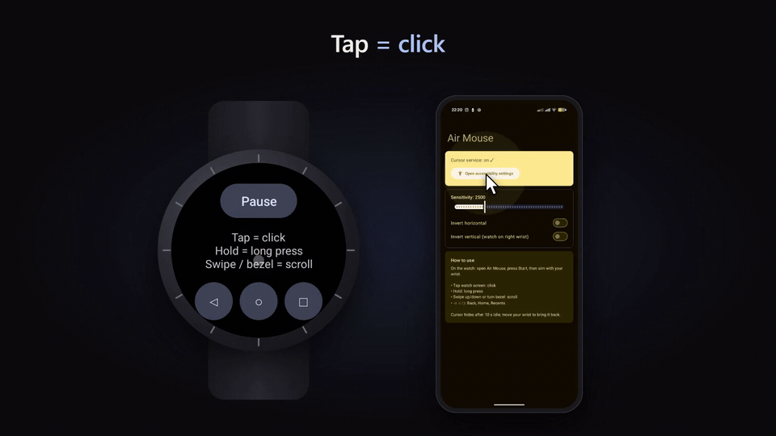

# Air Mouse

Use a Galaxy Watch (Wear OS 3+, Watch4 or newer) as an air mouse for your **Android TV**, or for the
Android phone it is paired with.

*Click the GIF for the full video with sound (`docs/demo.mp4`).*

| Target | How the watch reaches it |
| --- | --- |
| **Android TV / Google TV** (main) | Directly over Wi-Fi. The TV advertises itself on the network; no phone needed. |
| Android phone | Over Bluetooth via the Wearable Data Layer, when it is the watch's paired phone. |

## Download

Grab the APKs from the [latest release](https://github.com/archithulsurkar/air-mouse/releases/latest):

- `air-mouse-tv.apk` for the TV (Android TV 8.0+)
- `air-mouse-watch.apk` for the watch (Wear OS 3+)
- `air-mouse-phone.apk` for the phone (Android 8.0+), only if you also want phone control

The watch and phone APKs must come from the same release (the Data Layer requires the same signing key).
The TV has no such restriction. Sideload with `adb install`; for the watch use wireless debugging.

## Set up on a TV

1. Install `air-mouse-tv.apk` on the TV (e.g. `adb connect <tv-ip>` then `adb install air-mouse-tv.apk`).
2. On the TV open **Air Mouse** → **Open accessibility settings** → Air Mouse → On.
3. Make sure the watch has **Wi-Fi** on and is on the same network as the TV.
4. Open Air Mouse on the watch. It finds the TV and asks you to **Allow this watch** on it: on the TV,
   open Air Mouse and select **Allow &lt;your watch&gt;** under *Watches*.
5. Press **Start** on the watch.

Only approved watches can drive the TV; anything else on the network is ignored. Remove a watch
from the same *Watches* list.

## Set up on a phone

1. Install `air-mouse-phone.apk` on the watch's paired phone.
2. Phone: open Air Mouse → **Open accessibility settings** → Installed apps → Air Mouse → On.
3. On the watch, while paused, **tap the status line** to switch the target to *Phone*, then **Start**.

With several TVs (or a TV and the phone) around, tapping the status line cycles through them.
The watch remembers your pick.

## Controls (watch)

Hold the watch face towards you.

| Action | Result |
| --- | --- |
| Roll your wrist | Cursor up/down |
| Raise/lower your elbow | Cursor left/right |
| Tap screen | Click |
| Hold | Long press |
| Swipe up/down, turn bezel | Scroll |
| ◁ ○ □ | Back, Home, Recents |

Cursor going the wrong way? Pause, tap **Calibrate** on the watch and follow the prompts
(hold still, do your RIGHT move, do your UP move). The watch learns your own gestures.
Sensitivity and horizontal boost are set in the TV or phone app.

## How it works

- `wear/` reads the gyroscope and sends moves, taps, scrolls and buttons to the chosen target:
  UDP over Wi-Fi to TVs it finds with NSD (`_airmouse._udp`), or the Wearable Data Layer to the phone.
- `receiver/` is shared by the TV and phone apps: an AccessibilityService that draws the cursor and
  performs clicks, scrolls and Back/Home/Recents. On the TV it acts on the item under the cursor
  (TV apps are built for the remote and often ignore touch), falling back to injected gestures.
- `tv/` and `mobile/` are thin apps that plug in their transport (LAN or Data Layer).
- `protocol/` holds the message paths and the UDP packet format shared by all of them.

## Build

Open the folder in Android Studio (it creates `local.properties` with your SDK path), or run
`./gradlew assembleDebug`. Install `mobile` and `wear` from the **same machine**: the Data Layer only
connects apps with the same package name *and* signing key. `./gradlew :protocol:test` runs the
packet format tests.

## Notes

- The cursor freezes while your finger is on the watch so taps land where you aimed.
- The watch keeps Wi-Fi on while Air Mouse is open so it can reach the TV; it releases it when you leave.
- Sideloaded APKs on Android 13+ may show "Restricted setting" for accessibility; allow it from
  App info → ⋮ → Allow restricted settings. Installs from Android Studio are not affected.
- Packets on the LAN are not encrypted. Approval stops other devices from driving the TV by
  accident, but someone on your network who captures the traffic could replay a watch's id.
- Tuning constants: `wear/.../MainActivity.kt` (send rate, dead zone), `wear/.../Calibrator.kt` and
  `receiver/.../CursorService.kt` (tap/scroll timing, scroll scale).
